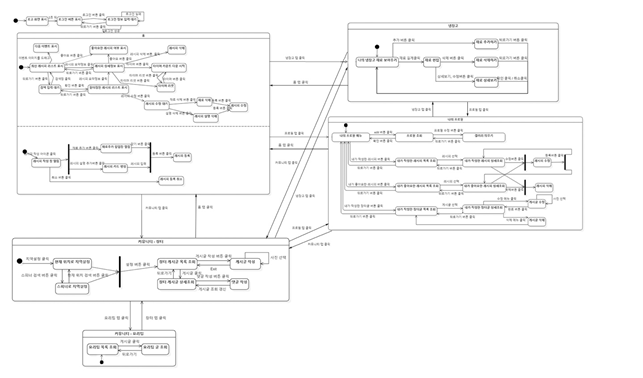

# Tangerine project : 뭐머귤래? 🍊
  
 

**Term project for Software engineering : Team SIXSENSE**

     
목차

     
  - [소개](#소개)
  - [역할 분담](#역할-분담)
  - [산출 문서](#산출-문서)
     - [State machine diagram](#state-machine-diagram)
  - [사용 기술](#사용-기술)
  - [사용한 APIs](#사용한-apis)
  - [Requirements](#requirements)
  - [향후 개선사항](#향후-개선사항)

  
## 소개

1인 가구를 위한 냉장고 관리 및 레시피 기능을 제공하는 안드로이드 어플리케이션입니다. 냉장고의 재료를 시각적으로 관리할 수 있고, 레시피를 생성 및 조회할 수 있습니다. 1인 가구에서 사용되고 남은 물건을 사고팔 수 있는 장터 게시판 기능을 제공합니다.

1. 카카오계정으로 로그인을 할 수 있습니다.
2. 레시피 등록/수정/삭제 기능을 제공합니다. 재료, 시간, 태그를 설정할 수 있습니다. 레시피의 하트 버튼을 누르면 '즐겨찾기 레시피'에서 볼 수 있습니다.
3. 냉장고 재료 추가/수정/상세보기/삭제 기능을 제공합니다.
4. 장터 게시판에서 우리 동네를 설정하고, 사람들과 남은 식재료를 사고 팔 수 있습니다.
5. 유용한 요리 팁을 소개합니다.
6. 프로필 사진과 닉네임을 변경할 수 있으며, 내가 좋아요한 레시피, 내가 작성한 레시피, 내가 작성한 게시물 목록을 볼 수 있습니다.

## 역할 분담
- 냉장고, 프로필 수정 : 권세희, 황영윤(팀장)
- 카카오로그인, 홈 - 레시피 : 김진선, 노강은
- 동네 위치설정, 장터게시판 : 송유진, 최지원

## 산출 문서
- [요구사항 정의서(SRS)](https://docs.google.com/spreadsheets/d/1aAH6LOKSH_gy26l1soGHsPVVNUKQ2eJc3T2wMxtxIHg/edit?usp=sharing)
- [소프트웨어 설계문서(SDS)](https://drive.google.com/file/d/1khjYd1C8UprFoMa_3XPZrgB129xaMEhB/view?usp=sharing)
- [발표 PPT](https://docs.google.com/presentation/d/1kA5-ugH5UoUlW7b7mETmIdnSBoM4q0lDmm9PtcKw40s/edit?usp=sharing)

## State machine diagram

## 사용 기술

- Mysql @5.7+
- Apache2 Server
- Android Studio @3.5.3
- PHP 8.0
- Java 11
- Naver Cloud Platform - Micro(g1)
  

## 사용한 APIs

- Open API of KAKAO ([https://developers.kakao.com/product/kakaoLogin](https://developers.kakao.com/product/kakaoLogin))

    카카오 계정으로 로그인하려면 이 사이트에 해시 키를 등록해야 합니다.

- Open API of NAVER map ([https://developers.naver.com/main/](https://developers.naver.com/main/))

    위치를 주소로, 또는 그 반대로 변환하고 싶다면 이 홈페이지에 가입하고 나만의 키를 받으세요.

- Open API of KOSTAT sgis ([https://sgis.kostat.go.kr/developer/html/openApi/api/intro.html](https://sgis.kostat.go.kr/developer/html/openApi/api/intro.html))

## Requirements

- 로그인을 위해서는 카카오계정이 있어야 합니다.
- 안드로이드 디바이스는 최소한 SDK 22 버전을 요구합니다.

## 향후 개선사항
- 레시피 추가 시 동영상 업로드
- ‘메인 화면’의 배너 광고를 클릭할 시 웹으로 이동
- 영수증을 찍으면 ‘나의 냉장고’에 재료들이 자동으로 추가
- ‘나의 냉장고’ 안에 있는 재료들로 만들 수 있는 레시피 추천
- 장터게시판에서 회원끼리 쪽지를 주고받을 수 있는 기능 추가
